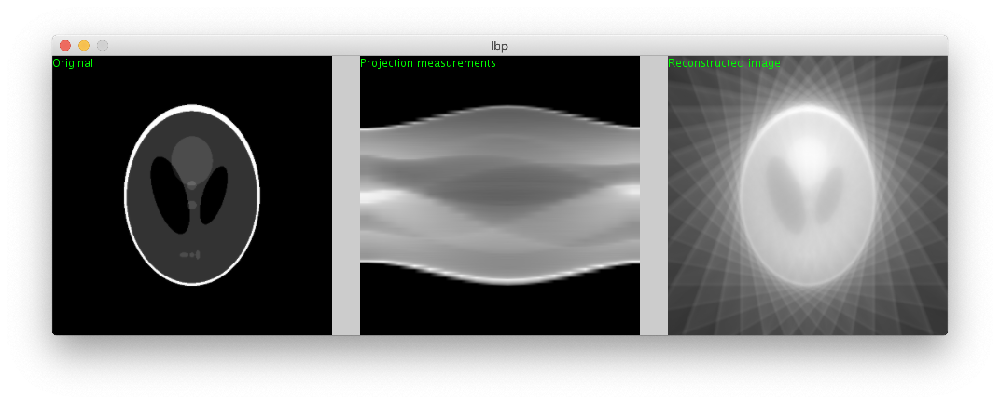

# Tomography Backprojection
A Java version of the linear back-projection algorithm for tomographic reconstruction, implemented in Processing.

## Basic Reconstruction

1) Download Processing IDE from: https://processing.org/download/
2) Download or clone this respository
3) Open lbp.pde with the Processing IDE and run the code

The reconstruction results should appear on the window:

## Interactive Reconstruction
1) Run lbp_interactive_version.pde 
2) Drag and drop the reposition the obstacles inside the container interior

