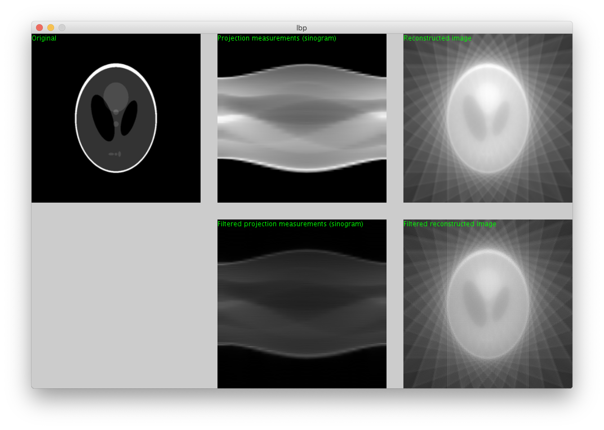

# java_tomography_backprojection
A Java version of the linear back-projection algorithm for tomographic reconstruction

## Usage

1) Download Processing IDE from: https://processing.org/download/
2) Download or clone this respository
3) Open lbp.pde with the Processing IDE and run the code

The reconstruction results should appear on the window:

